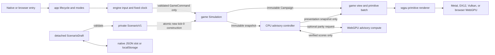

# Intergalactic Warfare WebGPU Design

> [!IMPORTANT]
> **Historical RulesV1 reference only.** This document is superseded as active program authority by [`2026-09-02-nyon-v2-design.md`](2026-09-02-nyon-v2-design.md). Preserve the implemented RulesV1 contracts described here, but do not restart its foundation, relocation, rebrand, legacy-migration, or platform-expansion work. NYON Galaxy Workshop additions must be implemented beside RulesV1 under the current design.

| Metadata | Value |
| --- | --- |
| Author | Donald J. Filimon and implementation contributors |
| Date | 2026-09-02 |
| Status | Accepted for implementation, expanded after reviewed Task 5 |
| Scope authority | This accepted design and its executable Tasks 6 through 12 |

## Overview

Intergalactic Warfare is a complete, single-player, real-time sector-control strategy game that runs from one Rust codebase on macOS, Windows, Linux, and WebAssembly in a WebGPU-capable browser. The player commands the cyan Astral Union against two deterministic AI factions across a seven-world sector. A factory-default session lasts roughly ten to fifteen minutes and ends when one faction controls five worlds or the player loses every world and fleet.

The expanded product adds two deliberately non-authoritative systems around the reviewed RulesV1 simulation. A detached scenario editor can validate, save, load, preview, and atomically start a new tick-0 campaign without mutating the active campaign. A transparent 12 to 4 to 1 neural advisory ranks worlds on CPU and, when supported, verifies an equivalent WebGPU compute result. Neither editor state nor advisory output can enqueue `GameCommand`, change simulation order, affect AI, decide an outcome, or enter the canonical state digest.

## Background and Motivation

Tasks 1 through 5 established the pinned Rust crate, integer campaign model, deterministic fixed-tick simulation, engine-owned input and timing, and a packed 36-byte primitive/layout layer. The remaining work must turn that reviewed foundation into the complete product rather than a macOS-only vertical slice. The prior design treated browser packaging, scenario editing, and neural compute as future work; the binding scope amendment makes all three current deliverables while preserving every reviewed RulesV1 constant, generator draw, and digest byte.

The design retains the strongest idea from the source conversation: RGBA-like vector fields are simulation inputs, not disconnected texture collectibles. Every planet has atmosphere, hydrosphere, and topology field strengths. Those fields affect production, travel, defense, and recurring sector hazards. All locations and factions are fictional; no real-world silo, city, target, weapon-effects, ethnic, or outbreak data is used.

## Goals

- Ship one shared native source set for macOS, Windows, and Linux through winit 0.30.12 and wgpu 30.0.1.
- Ship a real `wasm32-unknown-unknown` `cdylib` browser bundle that requires `wgpu::Backends::BROWSER_WEBGPU`; there is no implicit WebGL fallback.
- Preserve the reviewed deterministic campaign, generator, state digest, and fixed-step ordering exactly.
- Provide a complete detached seven-world scenario editor with validation, versioned JSON, native application-support persistence, and browser `localStorage` persistence.
- Provide a transparent advisory-only 12 to 4 to 1 model with a CPU reference, WebGPU compute path, strict parity checking, and CPU fallback.
- Keep the complete application `#![forbid(unsafe_code)]`, renderer-independent at the simulation layer, and testable without a live GPU where the behavior is CPU-owned.
- Separate unit, compile, bundle, provider-CI, live GPU, browser-runtime, and manual visual evidence.

## Non-Goals

- Multiplayer, network services, telemetry, accounts, cloud saves, mod scripting, replay-file persistence, audio, a general-purpose editor, or arbitrary world counts.
- A trained or adaptive model, an ML framework, online inference, advisory-driven automation, or a performance claim without a benchmark.
- WebGL fallback, server-side rendering, downloaded runtime art or fonts, or a DOM accessibility claim that the canvas does not implement.
- Changes to RulesV1 field coefficients, generator draws, default seed, base fleet speed 23, default digest `0x67D9_6E98_3D6C_9330`, or the Task 5 packed vertex/ring encoding.
- Real-world strategic, geographic, weapons-effect, demographic, climatic, epidemiological, or targeting data.

## Player Loop and Product Modes

In `Playing` mode the player:

1. Selects a friendly world.
2. Spends its stored energy to launch a fleet toward another world.
3. Captures neutral worlds or defeats hostile defenses.
4. Tunes the selected world's atmosphere, hydrosphere, or topology field to trade immediate energy for a production, travel, or defense advantage.
5. Reacts to deterministic ion storms and gravity tides that temporarily change field effectiveness.
6. Uses the advisory panel as an explanation-only priority hint.
7. Controls the configured win count before the AI factions do.

The first click selects a world. A right click on another world or the Space key launches from the selection to the hovered target. Number keys 1, 2, and 3 choose a field. Q and E reduce or increase that field. P pauses, R restarts the active validated scenario, H toggles help, F4 or the on-screen SCENARIO control opens the editor, and Escape clears the selection.

In `EditingScenario` mode fixed steps stop and the clock accumulator clears. The player edits only a detached `ScenarioDraft`, navigates by keyboard, pointer/touch, or wheel, and chooses REVERT, FACTORY DEFAULTS, REGENERATE FROM SEED, LOAD, SAVE, CANCEL, or APPLY AND RESTART. No gameplay action queues while the editor is open. Applying first validates a temporary `ScenarioV1` and constructs a temporary `Simulation`; the active scenario and simulation swap only after both succeed.

## Presentation

The playing view is a stylized command table with:

- a deep-space star field and faint tactical grid;
- seven animated planets with faction halos, orbit/range rings, and procedural field bands;
- curved-looking fleet trails represented by moving arrowheads and luminous route segments;
- a left mission panel, a right inspector and advisory panel, a top resource/status bar, and a bottom control strip;
- a GPU-rendered 5x7 bitmap font and geometric iconography, avoiding platform font and asset dependencies;
- a restrained palette: cyan for the player, ember for the Helix Dominion, violet for the Null Choir, and slate for neutral space.

The native application opens at 1440 by 900 logical pixels, remains readable down to 960 by 600, and renders at physical resolution. The browser canvas is appended and focused by winit and tracks its CSS/logical and backing/physical size. Primitive positions, hit tests, and the renderer's `Globals.viewport` always use the same logical viewport; only the surface texture/configuration uses physical pixels. This preserves alignment on Retina displays and browser device-pixel ratios. The editor switches at 1,100 logical pixels: wide mode uses a header, a 208-pixel left navigation rail, a live preview, a 420-pixel form, and a fixed footer; compact mode uses tabs, one scroll column, and a fixed footer. Interactive targets are at least 44 by 44 logical pixels. Because the primitive renderer has no scissor pipeline, editor rows wholly outside the visible form viewport are not emitted or hit-tested.

The canvas is keyboard accessible. Tab and Shift-Tab move focus; arrows and Page Up/Down navigate or adjust; Enter and Space activate; Escape cancels the current editor interaction; Backspace/Delete and committed text edit names and numeric strings. Text comes from key text or IME commit events, never from physical key codes. This design does not claim screen-reader semantics; that requires a separate semantic adapter.

## Architecture and Authority Boundaries

The project is a custom Rust engine rather than an integration with Bevy or another general game engine.



- `app` owns winit 0.30 lifecycle, `Playing` versus `EditingScenario`, active scenario replacement, session state, surface recovery, and advisory scheduling.
- `platform::native` owns native logging, the Tokio-hosted entry behavior, and the single returned startup-error boundary.
- `platform::web` owns console logging, panic reporting, `EventLoopExtWebSys::spawn_app`, winit canvas attributes, the same-thread asynchronous GPU mailbox, and `localStorage` access.
- `engine::gpu` owns the wgpu 30 instance, surface, adapter, device, queue, resize, and presentation. GPU creation remains async and takes an explicit backend policy.
- `engine::shader` parses and validates every WGSL source with Naga 30 before wgpu sees it. A shader validation failure stops startup with its label and diagnostic.
- `engine::render` uploads the immutable `PrimitiveBatch` and renders one alpha-blended pass. It decodes the reviewed Task 5 shape word as low 8-bit kind plus upper 24-bit ring-width ratio without changing the 36-byte vertex ABI.
- `engine::input` stores edge-triggered actions, pointer/touch state in logical coordinates, wheel movement, navigation keys, and committed text without leaking winit events into domain code.
- `engine::time` provides a clamped frame delta and fixed 60 Hz simulation steps.
- `game::model` defines worlds, factions, fleets, fields, events, phase, resources, and deterministic campaign truth.
- `game::simulation` advances economy, AI, movement, combat, capture, hazards, and victory without renderer, editor, browser, storage, or advisory dependencies.
- `game::view` performs playing-mode hit testing and emits presentation primitives from immutable state.
- `scenario` owns draft types, canonical names, validation, scenario fingerprints, JSON codec, and the storage interface.
- `editor` owns detached draft interaction, focus, layout, confirmation, widget emission, and inline errors.
- `advisory` owns the fixed CPU model, request scheduling, stale-result filtering, status, and optional wgpu compute backend. It cannot import or construct `GameCommand`.

Campaign/`Simulation` remains the sole gameplay authority. Selection, hover, help, editor focus, draft text, storage errors, advisory scores, GPU objects, browser objects, frame interpolation, pause, and the accumulator remain session or presentation state. The canonical state digest does not gain a scenario name, scenario fingerprint, advisor field, or platform field.

## Deterministic RulesV1

The default generated campaign uses seed `0x4947_5731_2026_0902`, generator version 1, rules version 1, and no wall-clock randomness. For that factory-generated case, those versions and seed plus the ordered game commands identify a replay. A general edited-scenario replay is identified by the validated `ScenarioFingerprint` plus the ordered commands, with the canonical state digest serving as a resulting-state checkpoint; versions and seed alone are insufficient once rules or world setup can differ. Any change to generator draws increments the generator version; any change to constants, phase order, arithmetic, or resolution rules increments the rules version. Campaign truth contains no floating-point values, platform time, pixels, GPU objects, or unordered-map iteration.

### Campaign Truth and Arithmetic

- Ticks are `u64`; `next_tick` is the tick that the next simulation step will execute. One second is exactly 60 ticks.
- Energy, defense, fleet strength, production, regeneration, route length, and route progress are non-negative fixed-point integers. One displayed unit is 1,000 stored milli-units. Multiplication uses `u128` intermediates, division rounds down, and bounded values clamp rather than wrap.
- Per-second production, regeneration, and movement retain their division remainders in campaign state. Advancing 600 ticks one at a time or in any grouping therefore produces the same state.
- World and fleet IDs are monotonic integers. Worlds are stored by `WorldId`, fleets by `FleetId`, commands by `(tick, sequence)`, and any grouped resolution is explicitly sorted before it can affect state.
- Stored energy is capped at 250,000 milli-energy and defense at 100,000 milli-defense. The base fleet speed is 23 sector units per second. Field levels range from 0 through 10. Atmosphere contributes 500 basis points per level to owned-world production, hydrosphere contributes 400 basis points per level to fleet speed, and topology adds 100 milli-defense per second per level to the owned-world base regeneration rate. Neutral worlds neither produce energy nor regenerate defense.
- The canonical state digest is 64-bit FNV-1a with offset `0xCBF2_9CE4_8422_2325` and prime `0x0000_0100_0000_01B3`. Its fixed-width little-endian byte stream contains `u32` rules and generator versions; `u64` seed and next tick; a `u8` phase tag (`0` running, `1` faction victory, `2` eliminated) and winning-faction payload when present; `u64` next fleet ID and next hazard index; a `u8` active-hazard tag and its event index, kind, field, start, and end payload when present; every world ID, position, owner tag (`0` neutral, `1` Union, `2` Helix, `3` Choir), quantity, field, and remainder in `WorldId` order; a `u64` fleet count; and every fleet scalar and remainder in `FleetId` order. It excludes pending commands, presentation, and session state and is diagnostic replay evidence rather than a security primitive. The default initial digest is `0x67D9_6E98_3D6C_9330`.

Only the presentation converts fixed-point values to `f32`. Fleet interpolation is derived from the rational pair `(progress, route_length)` and never feeds back into simulation.

### Generator V1

SplitMix64 is frozen as wrapping `u64` arithmetic: add `0x9E37_79B9_7F4A_7C15` to the state; xor-shift by 30 and multiply by `0xBF58_476D_1CE4_E5B9`; xor-shift by 27 and multiply by `0x94D0_49BB_1331_11EB`; then xor-shift by 31 for the result.

World IDs 0 through 6 use anchors `(1000, 5000)`, `(9000, 2500)`, `(9000, 7500)`, `(5000, 1000)`, `(5000, 9000)`, `(4000, 4000)`, and `(6000, 6000)`. For each world in ID order, Generator V1 consumes eight SplitMix64 results in this exact order:

1. x jitter and y jitter are each `(result % 1001) as i32 - 500` sector units and are added to the anchor;
2. base output is `1800 + result % 1201` milli-energy per second;
3. starting defense is `40_000 + result % 20_001` milli-defense;
4. base regeneration is `250 + result % 251` milli-defense per second;
5. atmosphere, hydrosphere, and topology levels are each `3 + result % 5`.

World 0 belongs to the Astral Union, world 1 to the Helix Dominion, world 2 to the Null Choir, and worlds 3 through 6 are neutral. Owned worlds start with 80,000 milli-energy; neutral worlds start with zero. The default-seed sector and initial canonical campaign hash are golden test contracts. Hazard selection uses one SplitMix64 result from a fresh state initialized with `seed ^ event_index`, so it does not consume or depend on generator state.

### Commands and Field Tuning

The only gameplay commands are:

- `Launch { source, target }`;
- `TuneField { world, field, direction }`, where direction is increase or decrease.

The input layer resolves clicks, selection, hover, Space, Q, and E into those explicit IDs. Each command is tagged for `next_tick` and with a monotonically increasing sequence. Commands for a tick execute in sequence order. A rejected command emits a typed rejection event and changes no campaign state.

A launch is valid only while the campaign is running, from an Astral Union world to a distinct world. All distinct worlds are reachable in RulesV1; range rings are presentation, not a route restriction. A valid launch sends half the source's stored energy, rounded down, and converts it one-for-one to fleet strength. The minimum launch is 10,000 milli-energy. The spent energy is removed immediately. Repeated same-tick launches observe the result of earlier commands.

Field tuning is valid only on an Astral Union world. Increasing a field by one level costs 20,000 milli-energy; decreasing it by one level recovers 10,000 milli-energy, capped by the world's energy limit. This makes Q a deliberate sacrifice rather than a no-op and makes every down/up cycle a net cost, so tuning cannot create energy. Commands at level 0 or 10 are rejected. A captured world retains its field levels but its stored energy becomes zero.

Pause, restart, selection, and help are not gameplay commands. Pause stops fixed steps and clears residual frame time so unpausing cannot catch up paused time. Restart clears pending commands and session state and constructs the initial campaign again from the configured seed.

### Fixed-Step Order

For tick `t`, `game::simulation` performs exactly these phases:

1. If the campaign is terminal, reject pending gameplay commands and do not change campaign truth.
2. Start or end hazards whose half-open boundary is `t`.
3. Capture one immutable start-of-tick snapshot for both AI factions.
4. Validate and apply player commands for `t` in sequence order.
5. When `t > 0` and `t % 60 == 0`, derive both AI intents from the shared snapshot and apply valid intents in Helix-then-Choir order.
6. Accrue owned-world energy and owned-world defense regeneration.
7. Advance every fleet using the active hydrosphere effect and collect arrivals.
8. Resolve all arrivals at each destination simultaneously.
9. Evaluate terminal outcomes.
10. Increment `next_tick`.

`engine::time` uses an integer rational accumulator. For each frame it performs `scaled_nanoseconds += min(frame_delta, 250 ms).as_nanos() * 60`, emits `scaled_nanoseconds / 1_000_000_000` steps, and retains `scaled_nanoseconds % 1_000_000_000`. The 250 ms clamp bounds a frame to fifteen catch-up steps. A zero-sized window suspends presentation but does not pause this clock or the campaign.

### Economy, Travel, and Capture

For an owned world, the atmosphere bonus is `500 * level` basis points. Its per-tick production numerator is `base_output * (10_000 + bonus) + remainder`, its gain is that value divided by `60 * 10_000`, and it retains the modulus as the next remainder. Defense regeneration uses the same carry rule with per-second rate `base_regeneration + 100 * topology_level` and denominator 60, up to the defense cap. A hazard halves only the selected field bonus before these formulas. Reaching an energy or defense cap discards excess gain and clears that accumulator's remainder, so the cap cannot hide deferred production or regeneration.

Sector positions and distances are integers. Route length is the floor of the integer square root of `dx * dx + dy * dy`. A fleet snapshots its source hydrosphere level at launch; later field tuning does not rewrite a fleet already in transit. Its speed per second is `23 * (10_000 + 400 * snapshotted_level) / 10_000` sector units, with an active hydrosphere hazard halving only the `400 * level` bonus. Movement divides by 60 with a stored remainder, and arrival occurs on the first tick whose progress reaches or exceeds route length.

Arrivals are aggregated by destination and faction before combat, independent of fleet storage order. The incumbent force is current defense plus arriving friendly strength; each other faction's force is its arriving strength. Neutral defense is the incumbent force of a neutral world. If one force is strictly greater than the sum of every other force, that faction controls the world with the difference as defense, clamped to the defense cap. Otherwise all forces are mutually exhausted: the incumbent retains the world at defense 1 if its force is at least as large as every individual attacker, and the world becomes neutral at defense 1 in every other case. All arriving fleets are consumed. Any ownership change clears stored energy, while fields persist. Fleets already in transit keep their launching faction even if their source changes owner.

### Deterministic AI

Each AI first evaluates at tick 60 and then once every 60 ticks. Both read the same start-of-tick snapshot and use no randomness.

For every owned world, the AI computes `threat deficit = hostile inbound strength - current defense - friendly inbound strength` as a signed integer. If any deficit is positive, it chooses the world by greatest deficit, then the smallest remaining-route-distance value among its hostile inbound fleets, then lowest `WorldId`. It chooses a different owned source able to make the minimum launch by shortest route to that world, then greatest launchable strength, then lowest `WorldId`.

If no feasible reinforcement exists, or no world is threatened, the AI attacks. A target's effective defense is current defense plus inbound strength belonging to its current owner. It chooses the reachable non-owned target by lowest effective defense, then lowest `WorldId`; it chooses a source by greatest launchable strength, then shortest route, then lowest `WorldId`. AI launches use the same half-energy and minimum-launch rules as the player. If no valid source-target pair exists, the faction does nothing. AI factions do not tune fields in RulesV1.

### Hazards

Hazard event `n` starts at tick `2,700 * (n + 1)` and is active on the half-open interval `[start, start + 720)`: the first event affects ticks 2,700 through 3,419 and is inactive at tick 3,420. Events never overlap. Display kind alternates ion storm for even `n` and gravity tide for odd `n`. The affected field is `splitmix64(seed ^ n) % 3`, mapped in atmosphere, hydrosphere, topology order.

During an event, only the selected field's contribution is multiplied by 5,000 basis points; base production, base speed, and base regeneration remain unchanged. Atmosphere therefore affects production on each active tick, hydrosphere affects in-flight movement, and topology affects regeneration. Restarting with the same seed reproduces the same event sequence exactly.

### Terminal Outcomes

After arrivals resolve, a faction controlling at least five worlds wins immediately. With seven worlds, two factions cannot both satisfy that condition. If nobody has won, the player loses only when the Astral Union controls zero worlds and has zero active fleets; an in-flight fleet can still recapture a world. The resulting terminal phase is absorbing: economy, AI, movement, combat, hazards, and gameplay commands can no longer mutate the campaign.

Numbers are intentionally game abstractions. Nothing is presented as orbital, epidemiological, nuclear, climatic, demographic, or geophysical prediction.

## Scenario Domain and Detached Editor

### Validated Scenario Types

`ScenarioDraft { seed, rules, worlds: [WorldDraft; 7] }` is the only editable representation and may be invalid. Array position is the dense `WorldId`; the editor cannot add, remove, or reorder worlds. `WorldDraft` edits name, x/y, owner, energy, defense, base output, base regeneration, atmosphere, hydrosphere, and topology. Rules/generator versions, tick rate 60, field coefficients, initial tick/phase/remainders/fleets/hazard, and the seven-world structure are read-only.

`ScenarioV1` has private fields and is constructible only by validation. `World.name` becomes owned `WorldName(Box<str>)`. A valid name is 1 through 24 bytes of canonical uppercase ASCII using only `A-Z`, digits, space, period, dash, and slash; it has no leading, trailing, or repeated spaces. The factory names are `ASTER VALE`, `KHEPRI`, `MERIDIAN`, `VESPER`, `ORISON`, `NACRE`, and `UMBRA`. This ownership/name change consumes no generator draw and does not alter the state digest, which has always excluded names.

Validation is all-or-nothing and reports field-addressable errors plus non-blocking warnings:

- exactly seven worlds with implicit dense IDs 0 through 6;
- `win_world_count` from 2 through 7;
- fixed `tick_hz == 60` and format/rules/generator versions equal to 1;
- AI period, hazard period, and hazard duration are nonzero; duration is no greater than period; checked first-event and subsequent boundary arithmetic cannot overflow;
- energy and defense caps are nonzero and cover every starting world; minimum launch is 1 through `maximum_energy / 2`; refund is no greater than raise; raise is no greater than maximum energy;
- x and y are each 0 through 10,000, field levels are 0 through 10, energy/defense are within their caps, and base output/base regeneration are non-negative `u64` values;
- no two worlds occupy the same position; at least one world belongs to the Union; no faction already meets the win count;
- with divisor `60 * 10_000`, each world's worst production numerator `base_output * 15_000 + (divisor - 1)`, worst regeneration rate `base_regeneration + 1_000`, and numerator `rate * 10_000 + (divisor - 1)` fit `u128`, and both post-division gains fit `u64`;
- worst effective fleet speed `base_speed * 14_000 / 10_000`, its numerator `effective_speed * 10_000 + (divisor - 1)`, and its post-division gain fit their destination types. In particular, validation proves `base_regeneration + 1000` and `base_speed * 14000 / 10000` fit `u64`; it does not rely only on the wider multiplication fitting `u128`.

Duplicate canonical names, positions closer than 250 sector units without being equal, either missing AI faction, and the absence of a Union source whose half-energy meets minimum launch are warnings. They do not prevent a valid scenario.

`Simulation::from_scenario(&ScenarioV1)` copies the validated rules and constructs a fresh tick-0 `Campaign` with empty fleets and pending commands, no active hazard, zero next IDs/indices and all arithmetic remainders zero. It records the scenario fingerprint. The existing public `from_campaign` remains a controlled fixture constructor and is never used by the app or editor. `R` reconstructs from the active `ScenarioV1`, not from factory defaults.

### Scenario Fingerprint and Replay Identity

`ScenarioFingerprint` is a domain-separated 64-bit FNV-1a value using the same offset and prime as the state digest but a different byte stream. It hashes explicit values, never JSON bytes:

1. bytes `IWSC\0`;
2. `u32` little-endian scenario format version 1, rules version 1, and generator version 1;
3. `u64` little-endian seed;
4. RulesV1 scalars in this order: `tick_hz` as `u32`, `win_world_count` as `u8`, then AI period, hazard first tick, hazard period, hazard duration, maximum energy, maximum defense, minimum launch, raise cost, refund, and base speed as `u64` little-endian;
5. each world in `WorldId` order: ID `u8`, name byte length `u8`, exact uppercase name bytes, x/y as `i32` little-endian, owner tag `u8` (`0` neutral, `1` Union, `2` Helix, `3` Choir), energy, defense, base output, and base regeneration as `u64` little-endian, then atmosphere, hydrosphere, and topology as `u8`.

`ReplayIdentity { scenario: ScenarioFingerprint, state: u64 }` pairs the scenario fingerprint with the existing canonical state digest. Replay-file serialization is not part of this scope.

### JSON and Persistence Contract

The versioned JSON object denies unknown fields, rejects payloads greater than 65,536 UTF-8 bytes before parsing, and requires exactly seven world elements. The canonical seed string is exactly 16 uppercase hexadecimal digits with no `0x` prefix. Every JSON field that represents a `u64`, including AI/hazard timing, caps, costs, speed, and world energy/defense/output/regeneration, is a canonical decimal string: either `0` or a nonzero digit followed only by digits, no sign, whitespace, fraction, exponent, or leading zero. Small version, owner, coordinate, win-count, and field-level values remain JSON numbers or enums because their validated ranges are exactly representable by browser tooling.

Decoding produces a draft and then validates it; encoding requires a valid draft and writes the typed structure in declaration order. The scenario fingerprint is never derived from serialized bytes. Loading never applies automatically. A failed size check, parse, string-number decode, version check, validation, or storage operation leaves both the current draft and active scenario unchanged. Saving requires validation success.

`ScenarioStore` exposes one optional UTF-8 JSON slot. Native storage uses these paths:

- macOS: `$HOME/Library/Application Support/Intergalactic Warfare/scenario-v1.json`;
- Windows: `%APPDATA%\\Intergalactic Warfare\\scenario-v1.json`;
- Linux: `$XDG_DATA_HOME/intergalactic-warfare/scenario-v1.json`, or `$HOME/.local/share/intergalactic-warfare/scenario-v1.json` when `XDG_DATA_HOME` is absent.

Native save creates the parent, writes a named temporary sibling in the same directory, flushes and `sync_all`s it, and atomically persists it over the slot. Browser storage uses `window.localStorage` key `intergalactic-warfare.scenario.v1`. Unavailable, denied, or quota-exceeded browser storage is a visible recoverable editor error.

### Editor State and Atomic Apply

Opening the editor snapshots the active scenario into `original` and `draft`. A shared ordered `Vec<EditorWidget>` is the single source for drawing, pointer hit testing, keyboard focus, label/value display, enabled state, and inline error state. The state machine owns selected section/world, focus index, scroll row, dirty state, validation report, confirmation action, and recoverable store message.

REVERT restores `original`; FACTORY DEFAULTS replaces the draft with the default seed/rules/worlds; REGENERATE FROM SEED regenerates only the seven world drafts from the edited seed while retaining edited rules; LOAD validates stored JSON into a temporary draft; SAVE validates and persists without applying; CANCEL returns to play and preserves the active campaign; APPLY AND RESTART validates and constructs temporary active state before swapping. REVERT, FACTORY DEFAULTS, REGENERATE FROM SEED, LOAD over a dirty draft, CANCEL with unsaved changes, APPLY AND RESTART, and SAVE when the one-slot store is already occupied require an explicit confirmation state. Saving to an empty slot does not. Cancelling overwrite confirmation preserves both the previous stored payload and detached draft. A confirmation is an editor presentation action, never a `GameCommand`.

After successful apply, the app swaps `active_scenario` and `simulation`, returns to `Playing`, and clears queued commands, input edges, selection, hover, fixed-clock residue, pause, and command sequence. Any failure occurs before the swap.

## Neural Advisory V1

The advisory is top-level presentation support and never part of `game::simulation`. It is a fixed, transparent, curated model version 1, not a trained model. One shared multilayer perceptron evaluates each of seven worlds with 12 inputs, 4 ReLU hidden units, and one output clamped to `[0, 1]`.

The 12 finite inputs are clamped individually to `[0, 1]` in this exact order:

1. 1 when the world is Union-owned, otherwise 0;
2. 1 when Helix- or Choir-owned, otherwise 0;
3. defense divided by 100,000;
4. energy divided by 250,000;
5. base output divided by 3,000;
6. base regeneration divided by 500;
7. hazard-adjusted atmosphere level divided by 10;
8. hazard-adjusted hydrosphere level divided by 10;
9. hazard-adjusted topology level divided by 10;
10. Union inbound strength divided by 100,000;
11. hostile inbound strength divided by 100,000;
12. minimum squared sector distance to a Union world divided by 200,000,000, or 1 when no Union world exists.

For features 7 through 9, an active hazard halves only the affected field level before normalization. The minimum distance includes the world itself when it is Union-owned. `NaN` or infinity is converted to a bounded fallback before clamping and can never enter the model.

W1 is row-major by hidden unit:

```text
[-.60, .55, -.80, 0, .35, -.20, .10, .10, -.10, .20, -.60, -.40]
[ .80,-.80, -.70,.15, .15,  .05,  0,   0,    0,  -.40, 1.00, -.20]
[  0,   0,  -.10,.15, .55,  .25, .20, .20,  .20,  0,  -.10, -.15]
[-.20, .20, -.35, 0,   0,    0,   0,  .25,   0,   .60, -.35, -.90]
```

`B1 = [.50, .10, -.25, .55]`, `W2 = [.45, .25, .20, .25]`, and `B2 = .10`. The CPU reference computes and publishes every request. Its factory-default seven `f32::to_bits()` score values become a golden test only after the implementation computes them from these constants; the design does not invent those derived bits.

The GPU packing is fixed:

| Buffer | Elements | Bytes | Usage |
| --- | ---: | ---: | --- |
| Features | `[f32; 84]` | 336 | `STORAGE | COPY_DST` |
| Weights | `[f32; 57]` | 228 | `STORAGE | COPY_DST` |
| Scores | `[f32; 7]` | 28 | `STORAGE | COPY_SRC` |
| Readback | `[f32; 7]` | 28 | `MAP_READ | COPY_DST` |

The weight buffer is 48 W1 values, 4 B1 values, 4 W2 values, and B2 in that order. Explicit bind-group minimum sizes match the table. `assets/shaders/advisory.wgsl` uses `@compute @workgroup_size(8)` and the host dispatches exactly `(1, 1, 1)` with `world_index >= 7` guarded. No optional feature is requested; adapters without `DownlevelFlags::COMPUTE_SHADERS` use CPU only.

At most one GPU request and readback buffer are in flight. A newer dirty snapshot replaces the one queued behind it. `map_buffer_on_submit` copies exactly seven scores, unmaps, and enqueues a small completion; native redraws call `Device::poll(PollType::Poll)`, browser WebGPU auto-polls, and neither path calls `Wait` in the frame loop. Every request/completion carries device epoch, request ID, model version, source tick, and source state fingerprint. A completion that does not match the current epoch/model/latest request/tick/fingerprint is dropped.

CPU/GPU parity requires, per score, `abs(cpu - gpu) <= 1e-5 + 5e-5 * max(abs(cpu), abs(gpu))`. A non-finite or out-of-range GPU value, parity mismatch, map/poll failure, or device error immediately republishes the CPU result as `CPU FALLBACK` and disables GPU advisory for that device epoch. Device recreation permits one fresh attempt in the next epoch.

Advisory requests occur at initialization, restart, every materially accepted command or emitted simulation event, and otherwise every 30 simulation ticks. Hover, resize, and render frames do not schedule work. The panel displays `NEURAL ADVISORY`, `ADVISORY ONLY`, priority world, score percentage, source tick, one of `CPU`, `WEBGPU`, or `CPU FALLBACK`, and `UPDATING` while a newer request is pending. The last snapshot remains visible across pending work and suspend/resume. Advisory code has no API that returns, emits, or enqueues `GameCommand`.

## Platform and Asynchronous Lifecycle

Native and browser entry points share one `App` and `ApplicationHandler<AppEvent>` state machine. Native `main` hosts a multi-thread Tokio runtime while `winit::EventLoop::run_app` retains the process main thread. Native `resumed` synchronously creates the window, wgpu instance, and surface, then moves only adapter/device acquisition to a Tokio worker. The worker stores `(generation, Result<GpuContext, GpuError>)` in a standard-library channel before sending the marker-only `AppEvent::GpuInitFinished { generation }`. `user_event` rejects stale generations, configures the latest physical size, and constructs renderer/advisory resources back on the winit thread. Suspension invalidates the generation and aborts pending initialization. Browser `resumed` must not block: it creates a generation token and calls `wasm_bindgen_futures::spawn_local` on the GPU future.

The browser bridge is deliberately marker-only. The wasm `App` owns `Rc<RefCell<Option<Result<GpuContext, EngineError>>>>` and an `EventLoopProxy<AppEvent>`. The local future stores its result in that same-thread mailbox, then sends only `AppEvent::GpuInitFinished { generation }`. `ApplicationHandler::user_event` validates the generation and takes the result into `self`. `GpuContext` is never sent through the proxy, never asserted `Send`, and never moved across browser threads. Both `ApplicationHandler<T>` and `EventLoopProxy<T>` require only `T: 'static`; the marker is cross-target `Send` by construction. Async browser failures are logged/stored once and then exit the loop rather than being synchronously returned.

Browser startup builds `EventLoop::<AppEvent>::with_user_event().build()` and calls `EventLoopExtWebSys::spawn_app`. Window attributes use `WindowAttributesExtWebSys::with_append(true)`, `with_prevent_default(true)`, and `with_focusable(true)` so winit creates, appends, focuses, and owns the canvas. Rust does not query a DOM canvas. `GpuContext` creates `Surface<'static>` safely from an owned `Arc<Window>`. For locked wgpu 30, it calls `InstanceDescriptor::new_without_display_handle()`, assigns `desc.backends = Backends::BROWSER_WEBGPU`, and passes the descriptor by value to `Instance::new(desc)`. `InstanceDescriptor` does not implement `Default` and wgpu 30 `Instance::new` does not take a reference. WebGL is not enabled as a fallback.

Native instance selection permits the wgpu primary native backends: Metal on macOS, DX12 on Windows, and Vulkan on Linux. Device requests use `Features::empty()` and explicit WebGPU-compatible `Limits::default()`. The adapter's downlevel compute flag gates only advisory compute, not rendering.

The browser crate is both `rlib` and `cdylib`. `web/index.html` imports generated `dist/intergalactic_warfare.js`; generated JS/WASM and the project-local wasm-bindgen CLI prefix are ignored. The build uses exact `wasm-bindgen = 0.2.127` and matching CLI, `wasm-bindgen-futures = 0.4.77`, `console_error_panic_hook = 0.1.7`, `console_log = 1.1.0`, and `web-sys = 0.3.104` with only `Storage` and `Window`. Wasm-only `web-time = 1.1.0` supplies frame `Instant` because the pinned target's standard-library implementation panics at runtime. `env_logger`, Tokio, and native atomic-file support are native-only dependencies. Pollster is development-only for the adapter-backed advisory test and is not part of either production startup path.

## Error Handling

Native startup errors are returned with context and printed once before exit. Browser asynchronous initialization errors are placed into app state, logged once through `console_log`, and cause the event loop to exit; no wasm API pretends to return a later error synchronously.

The wgpu 30 acquisition states are handled individually: Success renders and presents; Suboptimal renders and presents before reconfiguration; Timeout and Occluded skip that frame; Outdated reconfigures; Lost recreates the surface from the retained instance and window before configuring; Validation exits through the fatal error path. Zero-sized windows suspend presentation while fixed simulation continues in Playing mode. Suspension drops renderer and GPU state before returning; a later resume increments the device epoch and recreates resources idempotently.

Scenario validation and JSON errors are recoverable, field-addressable editor messages. Native I/O and browser `localStorage` denial/quota/unavailability are visible recoverable errors. Load/save failures never replace the draft or active scenario. Advisory unavailability, non-finite output, parity mismatch, map/poll error, or device-epoch mismatch never stops the game; the controller publishes CPU output, marks `CPU FALLBACK` where appropriate, and disables GPU advisory for that epoch.

## Rust and Dependency Constraints

- Rust edition 2024, pinned by `rust-toolchain.toml` to `nightly-2026-09-01`.
- `wgpu = 30.0.1`, `naga = 30.0.1`, stable `winit = 0.30.12`, exact wasm-bindgen family versions and wasm-only web-time from the platform section, serde/serde_json, and a native-only atomic temporary-file dependency.
- No ECS, game engine, UI framework, font renderer, physics engine, ML/training framework, network service, telemetry, or downloaded runtime asset.
- `unsafe` is forbidden in project source.
- Game state and rule tests run without a window or GPU. `game::model` and `game::simulation` do not import winit, wgpu, Naga, or renderer types.
- Shared native code targets macOS, Windows, and Linux. Browser code targets only `wasm32-unknown-unknown` with browser WebGPU.
- Native macOS Metal is the current live acceptance environment. Provider CI compilation on Windows/Linux and a real browser runtime are separate evidence layers.

## Security and Privacy Considerations

The application has no network service, telemetry, account, cloud sync, or remote asset fetch. Scenario data stays in one local application-support slot or one origin-scoped `localStorage` key. It contains only fictional configuration and is capped at 64 KiB, but all external JSON is still treated as untrusted: size is checked before allocation-heavy parsing, unknown fields and noncanonical integers are rejected, arithmetic is validated, and applying is atomic.

The scenario fingerprint and canonical state digest are diagnostics, not cryptographic authentication. No code presents them as tamper protection. Browser storage is origin-scoped but not confidential; no secrets or personal information belong in scenarios. The canvas prevents default input only while focused and provides an explicit Escape/CANCEL path. The project adds no `unsafe` block to bridge wasm objects, GPU mapping, or atomic persistence.

The advisor is bounded to read-only snapshots and has no command-producing interface. This architectural omission is the primary control against accidental automation. A compromised or numerically divergent GPU result can alter only the advisory panel, and parity failure restores the independently computed CPU score.

## Observability

There is no telemetry. Local logs record platform, selected adapter/backend/device type, surface format/color space, first frame presented, device epoch, advisory backend transitions, stale-completion drops at debug level, recoverable store operation class, and fatal startup diagnostics. Logs never include full scenario JSON or world names from user-authored content. Native uses `env_logger`; wasm uses `console_log` and `console_error_panic_hook`.

The UI exposes pause/editor mode, scenario validation errors/warnings, storage outcome, advisory source/status/source tick, and fatal browser startup through the console. Provider CI records exact commands per target. Screenshots and manual check notes are evidence artifacts and are not committed unless requested.

## Performance and Capacity Targets

- Seven worlds are fixed. Advisory input is 84 floats, weights are 57 floats, and output/readback is 7 floats.
- The frame loop makes at most one primitive draw call and one optional advisory compute dispatch. Advisory has at most one mapped request in flight and one coalesced pending request.
- The fixed clock caps one redraw at 15 simulation steps after a 250 ms delta clamp.
- Scenario JSON is at most 65,536 bytes; world names are at most 24 bytes.
- Editor rendering culls rows outside its form viewport and does not add a scissor pipeline.
- No GPU acceleration claim is made. For seven worlds, dispatch and readback overhead may exceed the CPU model cost; benchmark evidence is required before stating otherwise.

## Alternatives Considered

### Bevy or another engine

Rejected because the reviewed product already has deterministic model, input/time, primitive ABI, and layout layers. A general engine would add a second scheduler and larger dependency surface without solving browser async initialization, deterministic scenario validation, or advisory authority.

### DOM/HTML scenario editor beside the canvas

Rejected for V1 because it would create two rendering, input, layout, and persistence stacks and divergent native/browser behavior. The shared `EditorWidget` canvas model preserves one implementation and keyboard/pointer behavior. The trade-off is that V1 cannot claim screen-reader semantics.

### GPU scores as AI input

Rejected because GPU floating-point differences and asynchronous completion would enter deterministic campaign truth, break replay identity, and create an automation path. CPU/GPU parity is therefore presentation evidence only.

### Arbitrary world counts and free-form rules

Rejected because RulesV1, AI tie-breaks, layout, packed advisory buffers, and verification are built around exactly seven dense worlds. A future format version can define a different structure without weakening V1 validation.

### JSON-byte hashing

Rejected because whitespace, field order, and number spelling would make identity serializer-dependent. The explicit domain-separated fingerprint is stable across native and browser codecs.

### Blocking wasm initialization or sending `GpuContext` through a proxy

Rejected because blocking stalls the browser event loop and sending the GPU object assumes an unnecessary `Send` property. The marker-only proxy plus same-thread mailbox preserves winit ownership without unsafe code.

## Risks and Mitigations

| Severity | Risk | Mitigation |
| --- | --- | --- |
| High | Scenario values overflow reviewed integer formulas | Validation proves worst-case numerator, rate, speed, and post-division gains fit; apply cannot bypass validation. |
| High | Editor mutates a live campaign before complete validation | Draft is detached; apply constructs both validated scenario and simulation in temporaries and swaps once. |
| High | wasm lifecycle blocks or moves non-`Send` GPU state | `spawn_local`, same-thread `Rc<RefCell<...>>` mailbox, marker-only `AppEvent`, and target compile/runtime gates. |
| Medium | GPU advisory result is stale or divergent | Epoch/request/model/tick/state metadata, strict tolerance, stale drop, CPU fallback, and epoch-local disable. |
| Medium | Native behavior is inferred for untested platforms | macOS live evidence, Windows/Linux compile/test CI, and explicit non-claims for runtime/manual acceptance. |
| Medium | Canvas editor rows overlap or accept hidden input | Single widget list, 44-pixel targets, layout tests, and identical row culling for draw and hit-test. |
| Low | localStorage or application-support writes fail | Recoverable visible error; draft and active scenario remain intact; native same-directory atomic persist. |

## Rollout Plan

1. Preserve reviewed Tasks 1 through 5 and add the portable shader/GPU renderer.
2. Add scenario validation, codec/store contracts, and editor core behind app integration tests.
3. Add CPU advisory first, then optional compute and parity fallback.
4. Integrate native lifecycle and manually accept macOS at both target sizes.
5. Add the real wasm bundle and browser runtime, then commit native/WASM CI definitions and documentation.
6. Run the complete Task 12 gate, review the whole branch, correct observed failures, and rerun every affected layer.

Rollback is bounded by layer. A GPU-advisory failure falls back to CPU. An editor load/apply failure leaves the active game untouched. A browser bundle failure does not invalidate native evidence. A surface/device recreation creates a new epoch and retains the last advisory snapshot until replacement. No migration changes the existing state digest.

## Verification

The acceptance evidence is deliberately separated by layer:

1. `cargo fmt --all --check` succeeds.
2. `cargo clippy --all-targets --all-features -- -D warnings` succeeds on the current native host; the committed CI matrix defines the corresponding macOS, Windows, and Linux commands.
3. `cargo test --all-targets` succeeds. Renderer-free tests retain every existing campaign/replay invariant and add name, validation-boundary, overflow-proof, explicit fingerprint, canonical JSON, failed-load atomicity, editor focus/layout, advisory feature/weight/golden, schedule/coalescing, stale-result, and parity-tolerance coverage. The default state digest remains exactly `0x67D9_6E98_3D6C_9330`.
4. Naga validates both shipped shaders. Host tests assert the reviewed 36-byte vertex/ring decoder contract and advisory 336/228/28/28-byte buffer contract.
5. `cargo build --release` succeeds on macOS. A bounded native smoke initializes Metal, renders and presents, and is then terminated. This proves startup/rendering, not a complete playthrough.
6. An adapter-backed native advisory test compares seven GPU scores to the CPU reference using the specified tolerance. This proves parity on the tested adapter only.
7. `tools/build-web.sh` installs/uses the pinned wasm target and project-local matching wasm-bindgen CLI, creates `dist/intergalactic_warfare.js` plus `dist/intergalactic_warfare_bg.wasm`, and leaves generated files ignored.
8. A real WebGPU browser smoke from `http://127.0.0.1` verifies canvas creation/focus, first frame, playing controls, editor keyboard/pointer behavior, save/reload/load through the exact `localStorage` key, apply/restart, and advisory status. A wasm compile or bundle alone is not this evidence.
9. Manual native acceptance checks play, editor, storage, and advisory presentation at 1440 by 900 and 960 by 600 logical pixels. A scripted campaign finishing between 36,000 and 54,000 ticks remains a balance sentinel, not a claim about every human session.
10. `.github/workflows/ci.yml` defines macOS, Windows, and Linux native jobs plus a wasm compile/bundle job. The YAML is implementation evidence only until the provider actually runs it; Windows/Linux compile success is not a runtime/manual claim.

Headless tests prove campaign semantics, scenario identity, editor state transitions, advisory CPU behavior, and replay determinism. They do not prove a native surface, rendered visual quality, GPU parity, provider CI, browser WebGPU, localStorage permission, or a complete playthrough. Each claim requires its own gate above.

## Open Questions

There are no blocking implementation decisions. A semantic accessibility adapter, broader scenario formats, replay-file persistence, and advisory benchmarking are explicitly separate product decisions rather than hidden completion requirements.

## Deliverables

The project contains shared native/browser source, primitive and advisory WGSL, deterministic/scenario/editor/advisory tests, a generated-but-ignored WebAssembly bundle path, `web/index.html`, native/WASM CI definition, the design and executable implementation plan, and a player/developer README. The central `rust-webgpu-game-engine` Codex skill records the non-obvious winit/wgpu/Naga, browser async mailbox, advisory readback, and evidence-boundary lessons. Central skill sync remains blocked while unrelated pre-existing source/catalog deletions are unresolved; this work does not repair or stage those unrelated deletions.

## References

- Executable plan: `docs/superpowers/plans/2026-09-02-intergalactic-warfare.md`
- Reviewed campaign model: `src/game/model.rs`
- Reviewed simulation and state digest: `src/game/simulation.rs`
- Reviewed Task 5 packed primitive ABI: `src/engine/primitives.rs`
- Reviewed playing layout: `src/game/view.rs`

---

## Accepted Tactical 3D Command-Deck Amendment

This amendment is authoritative for Tasks 13 through 18. It supersedes only the
earlier single-2D-pass presentation limit, the prohibition on bundled font/icon
assets, and the one-pass/no-depth renderer capacity target. All RulesV1,
campaign, scenario, command, advisory-authority, storage, and evidence contracts
above remain frozen.

### Product and authority boundary

The playing field becomes a constrained tactical 3D command deck. Deterministic
sector `x/y` maps to centered presentation `x/z`; all height, rotation, route
curvature, particles, lighting, camera animation, bloom, and visual time are
derived presentation data. A domain-tagged visual seed is derived from
`ScenarioFingerprint`; Generator V1 is never invoked or consumed by rendering.

`game::model` and `game::simulation` remain renderer-independent and retain the
canonical digest `0x67D9_6E98_3D6C_9330`. The scenario editor remains a 2D
authoring surface with an optional non-authoritative 3D preview. No camera,
selection, hover, animation, command preview, quality, onboarding, preference,
or game-speed value is serialized into `Campaign` or scenario JSON.

The visual language is a holographic command deck: deep procedural space,
luminous cyan/ember/violet faction identity, dark translucent panels,
procedural worlds, tactical arcs, restrained bloom, crisp bundled typography,
and motion that reinforces rather than obscures strategic information.

### Presentation interfaces

The following public presentation/session types are added without changing
`GameCommand`:

- `CameraState`: target, yaw, pitch, distance, current/target matrices,
  reduced-motion behavior, and logical viewport.
- `CameraController`: orbit, zoom, reset, gesture ownership, touch tracking,
  thresholds, and clamped update policy.
- `CameraMatrices`: view, projection, view-projection, and inverse
  view-projection.
- `SceneRay` and `WorldHit`: logical pointer-to-ray conversion and nearest
  positive ray/sphere intersection, tied by `WorldId`.
- `SceneFrame`: immutable worlds, routes, fleets, background/effects, camera,
  advisory presentation metadata, visual time, and visual seed extracted from
  `&Campaign` plus session preferences.
- `RenderFrame`: logical viewport, physical target size, selected graphics
  path, 3D scene, SDF UI batch, and original primitive overlay.
- `UiBatch`: bounded SDF glyph/icon instances and panel geometry.
- `GraphicsQuality`, `MotionPreference`, and `UserPreferencesV1`.

`Simulation::preview_command(GameCommand)` is a pure query returning either
`CommandPreview` or the same `CommandRejection` used by execution. Launch and
tuning validation share one implementation so preview and execution cannot
drift. Preview never reserves a sequence, mutates energy, allocates a fleet, or
queues a command.

### Camera, picking, and input

The default camera targets the sector center at a 55-degree tactical pitch and
frames all seven worlds inside the gameplay rectangle remaining after HUD safe
areas. Yaw is limited to plus/minus 45 degrees from the default heading, pitch
to 35 through 70 degrees, and zoom to the tested range that preserves usable
world radii without crossing the command plane.

Dragging empty scene space or using the middle mouse button orbits. Wheel and
two-finger pinch zoom. `C` resets. A click/tap below the gesture threshold
selects; desktop right-click and Space preserve immediate launch. Touch uses
tap source, tap destination preview, then an explicit minimum 44-by-44 LAUNCH
control. Editor, settings, help, command tray, and all HUD rectangles consume
input before scene gestures or ray picking. Scale/resize recomputes projection
and logical picking while surface/depth/postprocess resources use physical
pixels.

### Scene extraction and rendering

Each rendered frame builds a new immutable `SceneFrame` from `&Campaign`, fixed
clock interpolation alpha, `ViewState`, advisory presentation state, visual
time, camera state, and preferences. Extraction emits exactly seven world
instances and bounded route, fleet, halo, and particle lists.

The sphere mesh is generated once per device epoch with 24 latitude and 48
longitude segments. Per-world instance data carries transform, ownership
color/pattern, field levels, energy, defense, selected/hovered state, and hazard
parameters. The shader produces procedural surface bands, atmosphere rim,
faction halo/shape cues, selection outline, field-energy detail, and static or
animated hazard response. No planet texture or map is downloaded.

Routes are elevated presentation curves. Fleet markers are emissive and
camera-facing, and use only the canonical integer progress numerator/denominator
for interpolation. Background stars and nebulae derive from the visual seed and
use subtle parallax unless reduced motion is active.

The renderer has four logical stages:

1. procedural space background;
2. depth-tested instanced worlds and opaque geometry;
3. transparent routes, fleets, halos, particles, and optional restrained
   half-resolution bloom;
4. SDF text/icons followed by the original primitive overlay.

The high path uses depth and 4x MSAA when supported. The low path uses one
sample, no bloom, fewer particles, and simplified atmosphere shading. Auto
attempts the high resource set and falls back monotonically without affecting
gameplay. Optional format, sample-count, limit, or allocation failure is
recoverable; WGSL parse/validation failure is fatal and includes the asset label
and Naga diagnostic. Zero extents allocate no surface-dependent targets.

The original 36-byte `Vertex`, packed ring decoder, primitive shader, and 5x7
font remain intact for editor, fallback UI, diagnostics, and compatibility
tests. Mesh, world-instance, route-instance, and SDF glyph-instance ABIs are
separate, size-asserted layouts synchronized with WGSL declarations.

### Offline usability and preferences

First-run onboarding pauses simulation and clears clock residue. It leads the
player through selecting a Union world, previewing and launching a fleet,
tuning a field, reading advisory status, and opening the scenario editor. It is
skippable and restartable from Help.

Worlds, field controls, advisory state, camera controls, editor actions, and
disabled/rejected commands expose contextual tooltips. The command tray shows
source, destination, proposed launch strength, and typed validity/rejection,
but queues nothing until explicit LAUNCH or an existing immediate shortcut.

`GameSpeed::{Paused, Normal, Fast, VeryFast}` maps wall time to 0x, 1x, 2x, and
4x while every simulation call remains exactly one canonical 60 Hz step.
Changing speed clears the fixed-clock accumulator. `P` toggles pause and resume;
`[` and `]` step through speed values.

Settings provides UI scale 85/100/115/130 percent, reduced motion, high
contrast, Auto/Low/High graphics, and onboarding reset. Only these values and
onboarding completion persist in a separate versioned record capped at 16 KiB:
native `preferences-v1.json` beside the scenario slot and browser key
`intergalactic-warfare.preferences.v1`. Unknown version, malformed/oversized
data, unavailable/denied storage, or quota failure returns defaults and one
recoverable message without affecting scenario or campaign state.

Reduced motion disables camera easing, parallax, pulsing halos, route particles,
transition zoom, and nonessential rotation while preserving fleet travel,
selection, ownership, fields, and hazards through static cues. High contrast
retains faction hues and adds shapes/patterns so no required state depends on
hue alone. Every new control has a visible focus state and minimum 44-by-44
pointer/touch target. The canvas remains keyboard-operable but no screen-reader
semantics are claimed without a semantic adapter.

### Reproducible hybrid assets

Gameplay visuals remain procedural. The only bundled visual assets are an
auditable 1024-by-1024 single-channel SDF atlas containing printable ASCII for
Inter Regular/SemiBold 4.1 and the required Lucide 1.27.0 SVG subset at commit
`4aec3f8`: play, pause, speed, reset, settings, help, crosshair, save, load,
check, close, zoom, and field controls.

The repository commits the Inter SIL Open Font License, Lucide ISC license,
official provenance URLs, source/archive hashes, selected SVGs, Regular and
SemiBold source fonts, a reproducible atlas builder, generated metrics, and the
generated R8 payload. Normal native/wasm builds use `include_bytes!` and never
access network or filesystem assets at runtime. Tests validate dimensions,
glyph bounds, unique mappings, required coverage, metrics parsing, and all
recorded source/output hashes.

### Explicit exclusions retained

There is no audio, campaign save/resume, photo mode, accounts, cloud saves,
multiplayer, networking, telemetry, downloaded runtime assets, arbitrary world
count, or advisory-driven automation. Provider CI, target compilation, native
GPU runtime, browser runtime, adapter parity, performance, and manual visual
evidence remain separately reported.

### Amendment acceptance

Automated acceptance freezes the factory scenario, digest, RulesV1 generator
order and constants, 36-byte primitive ABI, scenario wire format, and
tick-41,601 balance sentinel. It additionally covers preview/execution parity,
speed-to-direct-step equality, presentation fingerprint isolation, finite camera
matrices, deterministic picking, gesture thresholds, HUD-first hit testing,
DPI alignment, shader/ABI validation, exact seven-world batching, resource
fallback/rebuild, atlas reproducibility, preference failure isolation,
onboarding no-catch-up behavior, scalable layouts, reduced motion, and high
contrast.

Runtime acceptance is recorded separately for native macOS and localhost
BrowserWebGpu at 1440x900 and 960x600. Reference screenshots remain uncommitted.
Performance measurements identify adapter/browser and report 95th percentile
frame time after warm-up; they never become a universal frame-rate claim.
